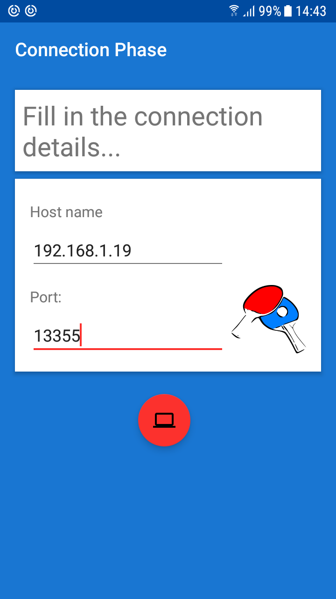
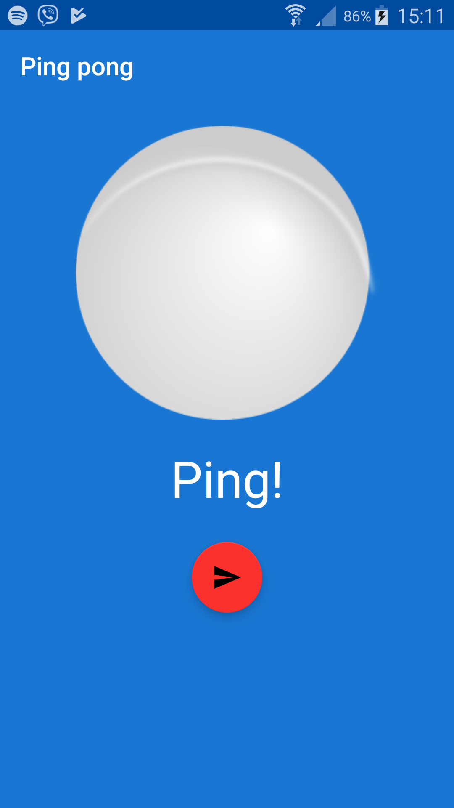

# PingPongAndroidClient

PingPongAndroidClient is an Android application that connects to the [PingPongBackEnd](https://github.com/tomasmichael995/PingPongBackEnd/blob/master/README.md) and interacts with it.

## Getting Started

Clone the app and open it with Android Studio. Run the app on your phone or tablet.
Enter the host name and the local port of the machine running the [PingPongBackEnd](https://github.com/tomasmichael995/PingPongBackEnd/blob/master/README.md).

After a successful connection, the user can send *pongs* and receive *pings* as replies from the server.

### Prerequisites

- Android SDK.
- The [PingPongBackEnd](https://github.com/tomasmichael995/PingPongBackEnd/blob/master/README.md) application running to interact with its server.
- Ensure your device running the app and the machine running the server are connected to the same network.
